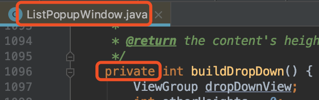

# AutoCompleteTextView最佳实践

写这篇文章主要是为了记录一次使用AutoCompleteTextView(以下简称ACTV)的踩坑过程，并复盘整个的解决流程。如果有心急的读者只想了解ACTV的基本使用方法可以直接参看——[《AutoCompleteTextView最佳实践-最简例子篇》](./simplest_sample/README.md)

**关于作者**

> 景三，程序员，主要从事Android平台基础架构方面的工作，欢迎交流技术方面的问题，可以去我的[Github](https://github.com/relish-wang)提issue或者发邮件至relish.wang@gmail.com与我交流。

[TOC]

## 一、AutoCompleteTextView简介
AutoCompleteTextView是一个可编辑的文本视图，可在用户键入时自动显示候选文本(以下简称ACTV)。候选文本列表显示在下拉菜单中，用户可以从中选择要替换编辑框内容的项目。

由以下的继承树，可以知道ACTV是继承自EditText的，它拥有EditText的所有功能。EditText我们已经再熟悉不过了。ACTV除了继承自EditText，它还是实现了Filter.FilterListener接口。FilterListener接口是用于监听ACTV内容改变时匹配对应的候选词列表。接下来就介绍一下它独特的功能属性。


## 二、AutoCompleteTextView的基本使用
**AutoCompleteTextView常用属性**

| 属性 | 描述 | 对应的Java方法 | 备注 |
| :-   | :-   | :-   | :-   |
|android:completionHint|设置出现在下拉菜单底部的提示信息|setCompletionHint(String hint)|hint不为空时生效|
|android:completionThreshold|设置触发补全提示信息的字符个数。最小值为1，设置的数值小于1时则置为1。|setThreshold(int threshold)|默认值为2(既不在布局文件中设置，也不调用Java方法设置threshold)。最小值为1，设置小于1的数字，会自动纠正为1。|
|android:dropDownHeight|设置下拉菜单的高度|setDropDownHeight(int height)|默认是WRAP_CONTENT。也可以设置为MATCH_CONTENT或具体的数值(java方法设置的数值的单位为像素)|
|android:dropDownWidth|设置下拉菜单的宽度|setDropDownWidth(int width)|同上。|
|android:dropDownVerticalOffset|设置下拉菜单于文本框之间的垂直偏移量|setDropDownVerticalOffset(int offset)|java方法设置的数值的单位为像素。|

**AutoCompleteTextView#setAdapter**

根据ACTV的源码可以知道，设置ACTV的Adapter需要继承ListAdapter且实现Filterable接口。因此可以使用ArrayAdapter。如果`ArrayAdapter`无法满足你的需求，则可以选择自定义Adapter。


因此ACTV设置了Adapter后就可以实现键入关键字显示候选词的效果了。

**[最简例子](./simplest_sample/README.md)效果展示**


## 三、需求简介

国际惯例先展示最终效果图：  


*笔者声明: 以下内容均已去除公司业务相关的敏感信息，纯属用于技术研究探讨。*

- 1 启动App打开登录页，默认加载最近一次登录的账号和密码
- 2 候选列表的高度为3条账号记录的高度
- 3 候选列表必须在输入框的下方(**提前剧透, 此处有大坑**)
- 4 输入手机号时，候选账号的手机号命中部分**高亮显示**
- 5 点击候选列表的右边x图标，item左滑显示删除按钮，点击删除，则删除此条账号记录
- 6 点击账号输入框右侧的x图标，清除账号输入框内容。党账号输入框无内容是不显示x图标；密码输入框同理
- 7 密码输入框右侧有切换密码可见性的按钮

*设计稿(已脱敏)*：


## 四、功能点实现

上述的功能点很多，这里我们着重讲解一下ACTV使用相关的功能实现(即第1~3条功能点)。其他功能将放在其他文章中详细讲解。

### 1 启动App打开登录页，默认加载最近一次登录的账号和密码

从SharedPreference里取出来第一条账号，默认填充到手机号/密码的输入框里。(较简单，不赘述。)

### 2 候选列表的高度为3条账号记录的高度

前面介绍过ACTV有一个`android:dropDownHeight`属性，对应的Java方法是`autoCompleteTextView#setDropDownHeight(int height)`。但问题在于**一条账号记录的高度**不是一个精确的数值。这也难不倒我，直接测量一条item的高度就成了。

那么问题来了，要获得itemHight首先要取得列表控件。如果你已经阅读过了[《AutoCompleteTextView最佳实践-最简例子篇》](./simplest_sample/README.md)的拓展阅读，你就会知道，ACTV的候选列表是一个窗口，具体的实现类是ListPopupWindow(以下简称LPW)。(没看的读者走一下[传送门](./simplest_sample/README.md#二、拓展阅读)再回来~)

因此列表控件也在LPW里。通过阅读LPW的源码可以知道，这个列表控件就是DropDownListView，是ListView的子类。


你如果不信上图的红字的话，我们来看一下ACTV里的setAdapter中是不是调用了LPW的setAdapter。


那么问题来了，找到了这个类有什么用，你需要取到对应的实例对象才行，而我们现在手里只有ACTV对象。那么久让我们从ACTV出发。通过查看ACTV源码，我们发现LPW对象是ACTV一个私有属性。


那么我们反射走一趟，拿到LPW对象。

```java
/**
 * 获取ACTV的ListPopupWindow对象
 *
 * @param textView AutoCompleteTextView
 * @return ListPopupWindow对象
 */
private static ListPopupWindow getListPopupWindow(AutoCompleteTextView textView) {
    try {
        Class<?> aClass = textView.getClass();
        Field field = null;
        while (aClass != null) {
            try {
                field = aClass.getDeclaredField("mPopup");
            } catch (NoSuchFieldException ignore) {
            } finally {
                aClass = aClass.getSuperclass();
            }
            if (field != null) break;
        }
        if (field == null) return null;
        field.setAccessible(true);
        return (ListPopupWindow) field.get(textView);
    } catch (Exception e) {
        return null;
    }
}
```



```java
/**
 * 反射调用ListPopupWindow的buildDropDown()方法, 获取列表总高度
 *
 * @param popup ListPopupWindow
 * @return 高度
 */
private static int buildDropDown(@NonNull ListPopupWindow popup) {
    try {
        Class<? extends ListPopupWindow> clazz = popup.getClass();
        Method buildDropDown = clazz.getDeclaredMethod("buildDropDown");
        buildDropDown.setAccessible(true);
        return (int) buildDropDown.invoke(popup);
    } catch (NoSuchMethodException e) {
        e.printStackTrace();
    } catch (IllegalAccessException e) {
        e.printStackTrace();
    } catch (InvocationTargetException e) {
        e.printStackTrace();
    }
    return -2;// -1 代表已存在；-2代表异常
}
```

好了，现在我们有LPW对象了。如法炮制我们要拿到DropDownListView对象。通过查看ACTV源码，我们发现DropDownListView对象是LPW的一个私有属性。


那么我们再通过反射，拿到DropDownListView对象。不过DropDownListView在Android源码里是被标注了@hide的，我们无法直接拿到这个类，不过我们向上转型成它的父类ListView即可。


```java
/**
 * 获取DropDownListView对象
 *
 * @param lpw ListPopupWindow
 * @return DropDownListView对象
 */
private static ListView getDropDownListView(ListPopupWindow lpw) {
    try {
        Class<?> aClass = lpw.getClass();
        Field field = aClass.getDeclaredField("mDropDownList");
        field.setAccessible(true);
        return (ListView) field.get(lpw);
    } catch (NoSuchFieldException ignore) {
    } catch (IllegalAccessException ignore) {
    }
    return null;
}
```

现在ListView的对象实例也拿到了，那么要怎么获取ListView中一条item的高度呢？

```java
/**
 * 获取ListView的一条item的高度
 *
 * @param listView DropDownListView
 * @return 一条item的高度
 */
private static int getListViewItemHeight(ListView listView) {
    ListAdapter listAdapter = listView.getAdapter(); //得到ListView 添加的适配器
    if (listAdapter == null) return -1;
    View itemView = listAdapter.getView(0, null, listView); // 获取其中的一项
    itemView.measure(View.MeasureSpec.UNSPECIFIED, View.MeasureSpec.UNSPECIFIED); // 进行这一项的测量
    return itemView.getMeasuredHeight();
}
```

这里我们就可以拿到一条item的高度了。不过在测量的时候还有一个小小的策略：

- 当匹配到的账号数量小于3时，为ACTV的候选列表高度设置为WRAP_CONTENT。
- 当匹配到的账号数量大于等于3时，为ACTV设置为3条账号记录的高度。即itemHeight*3。

为什么这么做呢？因为强制设置成3条记录的高度的话，当只有1或2条记录时，底下会有一块空白出现，页面展示很不友好。

稍稍总结下上面提到的所有方法：

- 1 通过ACTV反射获取**LPW对象**
- 2 根据1中拿到的LPW对象反射调用buildDropDown方法获取**列表高度**
- 3 通过LPW反射获取**DropDownListView对象**(DropDownListView被标注了@hide, 故只好用其父类ListView接收[向上转型])
- 4 通过DropDownListView对象测量出**一条item的高度**
- 5 **列表总高度** 和 **单条Item高度*设定的Item数量** 之间取最小值, 为ACTV设置高度

那么综上所述，观察仔细的读者会发现这三个方法都是private的。是的，我们把这3个方法写在一个工具类里，然后我们还需要提供一个供外部调用的入口方法：

```java
/**
 * 设置AutoCompleteTextView的候选列表高度
 *
 * @param textView AutoCompleteTextView
 * @param maximum  候选记录最多可显示的条数(现在定的是3)
 */
public static int setDropDownHeight(AutoCompleteTextView textView, int maximum) {
    try {
        // 1 反射获取ListPopupWindow对象
        ListPopupWindow mPopup = getListPopupWindow(textView);
        if (mPopup == null) return -1;
        // 2 反射调用buildDropDown方法获取列表高度
        int buildDropDown = buildDropDown(mPopup);
        if (buildDropDown < 0) buildDropDown = Integer.MAX_VALUE;
        // 3 反射获取DropDownListView对象(DropDownListView被标注了@hide, 故只好用其父类ListView接收[向上转型])
        ListView mDropDownList = getDropDownListView(mPopup);
        if (mDropDownList == null) return -1;
        // 4 测量出一条item的高度
        int itemHeight = getListViewItemHeight(mDropDownList);
        // 5 关键代码: 列表总高度 和 单条Item高度*设定的Item数量 之间取最小值
        int height = Math.min(buildDropDown, itemHeight * maximum);
        textView.setDropDownHeight(height);
        return height;
    } catch (Exception ignore) {
    }
    return -1;
}
```

*工具类完整代码: [ACTVHeightUtil.java](./app/src/main/java/wang/relish/textsample/ACTVHeightUtil.java)*

接着，我们把这个方法拿去给ACTV设置上，一运行。诶？怎么肥四呀？不管用啊？？？

```java
AutoCompleteTextView mPhoneView = findViewById(R.id.act_account);
ACTVHeightUtil.setDropDownHeight(mPhoneView, 3)
```


通过调试发现，当我们调用的时候`getDropDownListView(mPopup);`取到的`mDropDownListView`为null。根据实际情况考虑我们也应该知道在View初始的时候, 我们并不知道我们会过滤出多少数据，应该这个ListView也未初始化，因此取到的是null。这就意味着我们应该在*恰当的时候*为`mDropDownListView`设定高度。那么问题来了，什么时候才是**恰当的时候**? 那么我们再来看一波源码，看一下`mDropDownListView`在何时被初始化。

**ListPopupWindow#buildDropDown**

我们可以看到`mDropDownList`的实例化在`ListPopupWindow`中`buildDropDown`方法中。那么`buildDropDown`在哪里被调用呢？阅读过[《AutoCompleteTextView最佳实践-原理剖析篇》](./doc/AutoComleteTextView最佳实践-原理剖析篇.md)的读者会这道，`buildDropDown`是在`ListPopupWindow`的`show`方法中调用的。

```java
private int buildDropDown() {
	  // ...省略部分代码...
    if (mDropDownList == null) {
      	// 实例化mDropDownList
        mDropDownList = createDropDownListView(context, !mModal);
        mDropDownList.setAdapter(mAdapter);
        mDropDownList.setOnItemClickListener(mItemClickListener);
        mDropDownList.setFocusable(true);
        mDropDownList.setFocusableInTouchMode(true);
        // ...省略部分代码...
    }
}
```

**ListPopupWindow#show**

那么`ListPopupWindow`的`show`方法是在哪里被调用的呢？那就是ACTV的`showDropDown`方法中。

```java
@Override
public void show() {
    int height = buildDropDown();
    // ...省略部分代码...
}
```
**ACTV#showDropDown**:

```java
 public void showDropDown() {
    // ...省略部分代码...
    mPopup.show();
    // ...省略部分代码...
}
```

兜了这么一大圈。我们知道了`mDropDownList`是在ACTV展示候选列表的时候才创建的。所以我们应该**在ACTV的`showDropDown`中`mPopup.show()`之后再进行`setDropDownHeight`**。有了思路，实际操作就简单了。ACTV的`showDropDown`方法是`public`的，因此我们可以自定义一个继承自ACTV的View，重写`showDropDown`方法:

```java
public class WXAutoCompleteTextView extends AppCompatAutoCompleteTextView {
   // ...省略部分代码(构造方法)...
    @Override
    public void showDropDown() {
        super.showDropDown();
        if (mListener != null) {
            mListener.afterShow();// 监听showDropDown方法执行之后的时机
        }
    }
    private OnShowWindowListener mListener;
    public interface OnShowWindowListener {
        void afterShow();
    }
}
```

在`LoginActivity`中使用:

```java
AutoCompleteTextView mPhoneView = findViewById(R.id.act_account);
mPhoneView.setOnShowWindowListener(() -> {
    if (mAdapter == null || mAdapter.getCount() == 0) return;
    ACTVHeightUtil.setDropDownHeight(mPhoneView, 3);
});
```

*完整的`LoginActivity`代码: [LoginActivity.java](./app/src/main/java/wang/relish/textsample/LoginActivity.java)*

再次运行起来，看一下效果:


### 3 候选列表必须在输入框的下方

这不就是在下面吗 何出此言？因为我测试用的手机都是大屏手机，手机号输入框下方哪怕除去软键盘的高度，剩下的空间还够放三条数据的高度。但是在部分小屏手机上会出现候选框在上方的情况。(要在大屏手机上复现这种情况也比较简单，将手机号输入框的位置调整到屏幕偏下方的位置)。


别慌，先分析一下问题：

- 1 为什么候选列表到上面去了？

- 2 什么情况下它会到下面去？

- 3 如何达成它展示下面的条件？

#### 1 为什么候选列表到上面去了？

当输入框底部距离屏幕底部的距离不足以放下**3条候选账号记录的高度+软键盘的高度**时(也可能是1条或2条候选账号记录)，候选账号列表窗口会显示到输入框的上方。*这种情况在小屏手机上容易出现；也可以通过下调手机号输入框在屏幕上的位置来复现。*


这次不看源码，我们看看源码上的注释。我们从ACTV的`showDropDown`方法开始找，找到`mPopup.show()`这行代码(`mPopup`是一个`ListPopupWindow`)，再在`ListPopupWindow`的`show`方法里看到`mPopup.showAsDropDown(getAnchorView(), mDropDownHorizontalOffset,mDropDownVerticalOffset, mDropDownGravity);`, 最终找到的是`PopupWindow`的`showAsDropDown`方法。看到这里我们来看一下`PopupWindow`的`showAsDropDown`方法上的注释:
```java
/**
 * Displays the content view in a popup window anchored to the corner of
 * another view. The window is positioned according to the specified
 * gravity and offset by the specified x and y coordinates.
 * <p>
 * If there is not enough room on screen to show the popup in its entirety,
 * this method tries to find a parent scroll view to scroll. If no parent
 * view can be scrolled, the specified vertical gravity will be ignored and
 * the popup will anchor itself such that it is visible.
 * <p>
 * If the view later scrolls to move <code>anchor</code> to a different
 * location, the popup will be moved correspondingly.
 *
 * @param anchor the view on which to pin the popup window
 * @param xoff A horizontal offset from the anchor in pixels
 * @param yoff A vertical offset from the anchor in pixels
 * @param gravity Alignment of the popup relative to the anchor
 *
 * @see #dismiss()
 */
public void showAsDropDown(View anchor, int xoff, int yoff, int gravity) {
		// ...省略部分代码...
}
```

我们主要看注释里的第二段，大致意思是:**如果屏幕上没有足够的空间来显示整个弹出窗口，此方法会试图查找可滚动的父布局。 如果没有可滚动的父布局，则指定的垂直定位属性将会被忽略，那么弹出窗口将锚定自身以使其可见。** 简而言之，就是说**当PopupWindow指定的位置显示不下时，它会自适应位置显示**。

感觉源码注释后，一下把三个问题都解答了。

#### 2 什么情况下它会到下面去？

下面的空间够它显示时。

#### 3 如何达成它展示下面的条件？

这个情况解法不唯一。我这里就说一种我想到的办法: **利用属性动画将布局推上去，使得输入框下方的空间足够展示候选列表窗口。**

既然选定了一个方案，那么我们就来实行这个方案。稍稍整理一下思路，可以想到需要考虑如下几个问题：**当键盘升起/消失的时候需要执行属性动画推动布局。(升起的时候往上推，消失的时候往下推或者说复原)；需要测量推动的距离(键盘高度+3行候选列表高度-输入框下方当前的高度)。**再将问题更加具体化: 我们需要**监听键盘的打开与消失**，并**测量键盘高度**，**输入框距离屏幕底部的高度**。

笔者尝试了很多**监听键盘事件**的方法，效果都不尽人意，最终我选择了[facebook/react-native](https://github.com/facebook/react-native)中监听键盘事件的方法，并将它的关键代码抽出来自用。(键盘事件监听代码传送门->[relish-wang/KeyboardListener](https://github.com/relish-wang/KeyboardListener))

到这里我们的思路算是理清楚了:



#### 滑动动画制作

上面3个问题都有了思路，也有了监听软键盘时间的办法，那么我们就可以开始做滑动的动画了。

要注意动画执行的时机：

- 1 当候选列表**窗口弹出**时(且窗口底部空间不足时), 将整个**布局上移**;
- 2 当**收起软键盘**时(如果之前上移过布局的话)，将整个**布局下移**;

##### 1 动画相关代码

动画相关的代码我们写一个方法放在[Util.java](./app/src/main/java/wang/relish/textsample/Util.java)中，供后续使用:

```java
private static final TimeInterpolator DEFAULT_INTERPOLATOR = new AccelerateInterpolator();
public static ObjectAnimator objectAnimator(View view, String propertyName, float from, float to,
                                            long duration, TimeInterpolator interpolator) {
    final ObjectAnimator objectAnimator = ObjectAnimator
            .ofFloat(view, propertyName, from, to)
            .setDuration(duration);
    objectAnimator.setInterpolator(interpolator == null ? DEFAULT_INTERPOLATOR : interpolator);
    return objectAnimator;
}
```

##### 2 设置键盘事件监听器

为页面的根布局View设置键盘事件的监听器。设置两个全局变量用于接收当前**屏幕可用高度**和当前**键盘高度**。

```java
private float mKeyboardHeight; // 当前键盘高度
private float mScreenHeight; // 当前屏幕可用高度
private float mHeightNeeded = -1; // 候选列表窗口底部需要的高度
boolean mIsShow; // 键盘是否弹出
public static final int KEYBOARD_CHANGE = 0xebad; 

private void onCreate(Bundle savedIn){
// 页面根布局View上添加键盘事件的监听器
    rootView.getViewTreeObserver().addOnGlobalLayoutListener(new GlobalLayoutListener(rootView,
            (isShow, keyboardHeight, screenWidth, screenHeight) -> {
                mIsShow = isShow;// 当前键盘是否显示
                if (isShow) {
                    mKeyboardHeight = keyboardHeight;// 当前键盘高度
                    mScreenHeight = screenHeight;// 当前屏幕可用高度
                } else {
                    mScreenHeight = 0;
                    mKeyboardHeight = 0;
                }
								// 发送键盘事件
                mHandler.removeMessages(KEYBOARD_CHANGE);
                mHandler.sendEmptyMessageDelayed(KEYBOARD_CHANGE, 100);
            }));
}
```

##### 3 执行动画

接前面键盘事件监听器里用到的的`mHandler`

```java
private Handler mHandler = new Handler() {
    @Override
    public void handleMessage(Message msg) {
        if (!mIsShow) {
            if (mPhoneView.isPopupShowing()) {
                mPhoneView.dismissDropDown();// 隐藏弹窗
            }
            animatorFromY2Y(0);// 回归初始状态
        } else {
            if (mPhoneView.isFocused() && mAdapter != null && mAdapter.getCount() > 0) {
                mPhoneView.showDropDown();// 展示弹窗
            }
        }
    }
};
/**
 * 记录动画移动到的位置
 */
private float mOldY = 0;
private void animatorFromY2Y(float newY) {
    ObjectAnimator animator = Util.objectAnimator(
            rootView,
            "translationY",
            mOldY,
            newY,
            0,
            null);
    animator.start();
    Log.d(App.TAG, "执行动画: " + mOldY + "->" + newY);
    mOldY = newY;
}
```

运行起来。完美！


## 最后的最后

虽然这是一个很小的需求，但里面蕴含的知识点可不少哟。感兴趣的读者可以参看其他系列文章

- [《AutoCompleteTextView最佳实践-最简例子篇》](./simplest_sample/README.md)
- [《AutoCompleteTextView最佳实践-原理剖析篇》](./doc/AutoComleteTextView最佳实践-原理剖析篇.md)
- [《AutoCompleteTextView最佳实践-键盘事件篇》](https://github.com/relish-wang/KeyboardListener/blob/master/README.md)
- 《AutoCompleteTextView最佳实践-其他功能篇》(未完成)