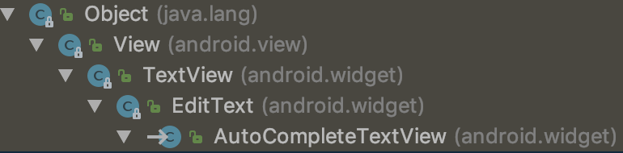
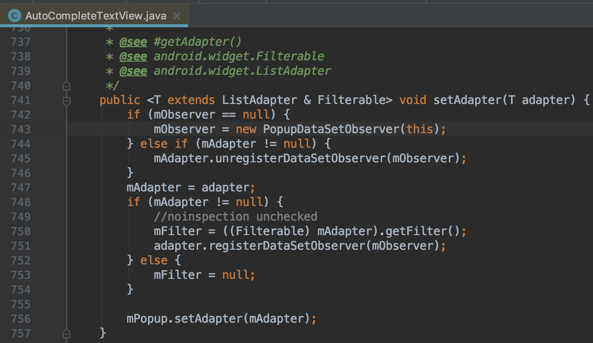
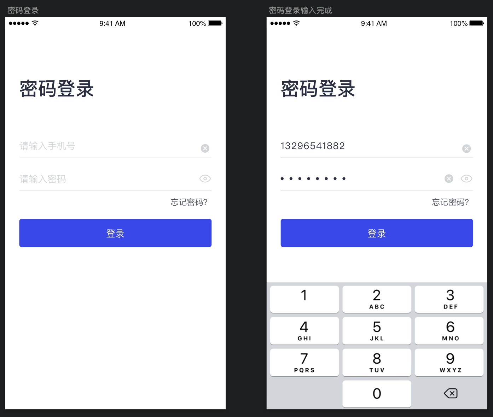
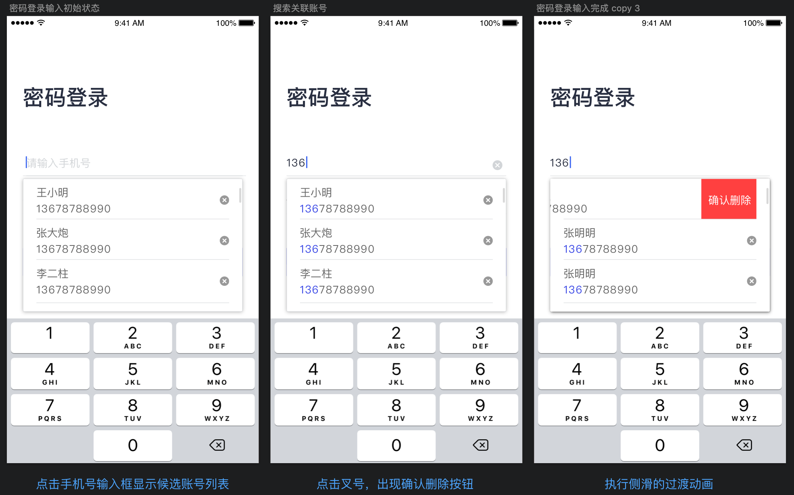

# AutoCompleteTextView最佳实践

写这篇文章主要是为了记录一次使用AutoCompleteTextView(以下简称ACTV)的踩坑过程，并复盘整个的解决流程。如果有心急的读者只想了解ACTV的基本使用方法可以直接参看——[《AutoCompleteTextView最简例子》](./simplest_sample/README.md)

### 一、AutoCompleteTextView简介
AutoCompleteTextView是一个可编辑的文本视图，可在用户键入时自动显示候选文本(以下简称ACTV)。候选文本列表显示在下拉菜单中，用户可以从中选择要替换编辑框内容的项目。

由以下的继承树，可以知道ACTV是继承自EditText的，它拥有EditText的所有功能。EditText我们已经再熟悉不过了。ACTV除了继承自EditText，它还是实现了Filter.FilterListener接口。FilterListener接口是用于监听ACTV内容改变时匹配对应的候选词列表。接下来就介绍一下它独特的功能属性。

### 二、AutoCompleteTextView的基本使用
**AutoCompleteTextView常用属性**

| 属性 | 描述 | 对应的Java方法 | 备注 |
| :-   | :-   | :-   | :-   |
|android:completionHint|设置出现在下拉菜单底部的提示信息|setCompletionHint(String hint)|hint不为空时生效|
|android:completionThreshold|设置触发补全提示信息的字符个数。最小值为1，设置的数值小于1时则置为1。|setThreshold(int threshold)|默认值为2(既不在布局文件中设置，也不调用Java方法设置threshold)。最小值为1，设置小于1的数字，会自动纠正为1。|
|android:dropDownHeight|设置下拉菜单的高度|setDropDownHeight(int height)|默认是WRAP_CONTENT。也可以设置为MATCH_CONTENT或具体的数值(java方法设置的数值的单位为像素)|
|android:dropDownWidth|设置下拉菜单的宽度|setDropDownWidth(int width)|同上。|
|android:dropDownVerticalOffset|设置下拉菜单于文本框之间的垂直偏移量|setDropDownVerticalOffset(int offset)|java方法设置的数值的单位为像素。|

**AutoCompleteTextView#setAdapter**

根据ACTV的源码可以知道，设置ACTV的Adapter需要继承ListAdapter且实现Filterable接口。因此可以使用ArrayAdapter。如果`ArrayAdapter`无法满足你的需求，则可以选择自定义Adapter。

因此ACTV设置了Adapter后就可以实现键入关键字显示候选词的效果了。

**[最简例子](./simplest_sample/README.md)效果展示**

### 三、需求背景

*笔者声明: 以下内容均已去除公司业务相关的敏感信息，纯属用于技术研究探讨。*

- 1 启动App打开登录页，默认加载最近一次登录的账号和密码

- 2 点击手机号输入框时，弹出候选列表
- 3 候选列表的高度为3条账号记录的高度
- 4 候选列表必须在输入框的下方(**提前剧透, 此处有大坑**)

- 5 点击候选列表的右边x图标，item左滑显示删除按钮，点击删除，则删除此条账号记录
- 6 点击账号输入框右侧的x图标，清除账号输入框内容。党账号输入框无内容是不显示x图标；密码输入框同理
- 7 密码输入框右侧有切换密码可见性的按钮

### 四、逐步实现

#### 1 启动App打开登录页，默认加载最近一次登录的账号和密码

