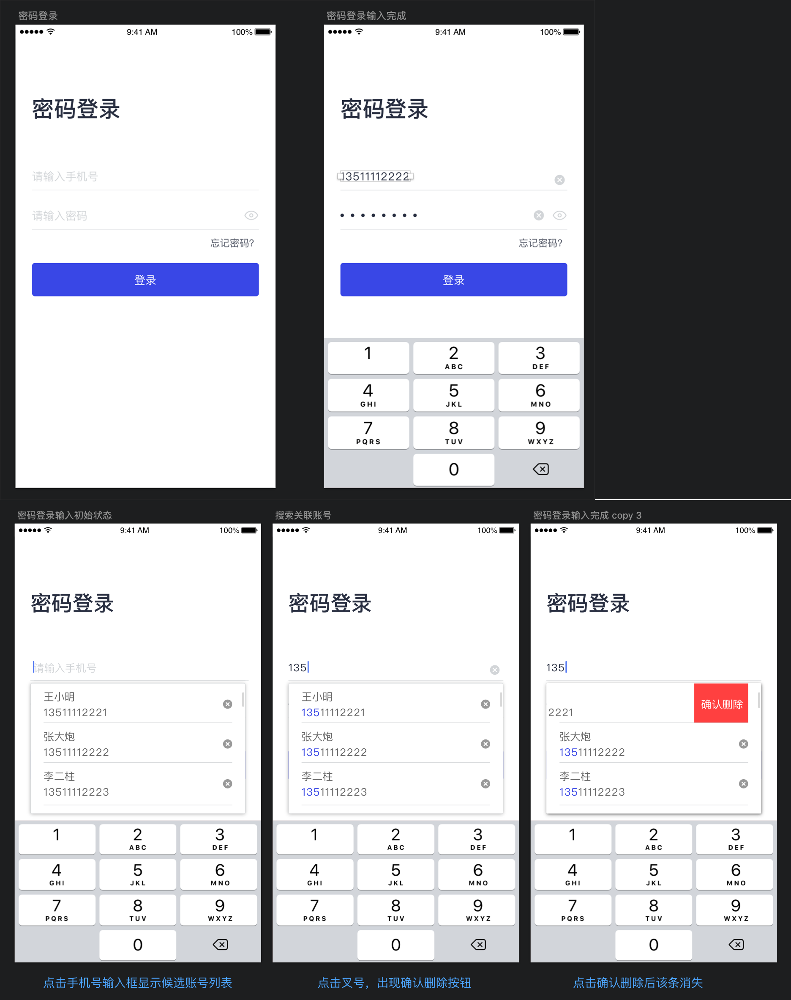
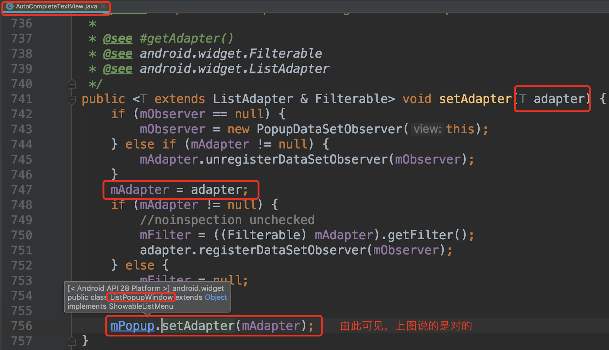
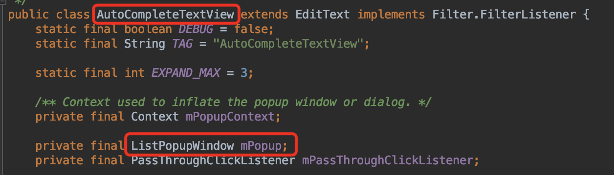
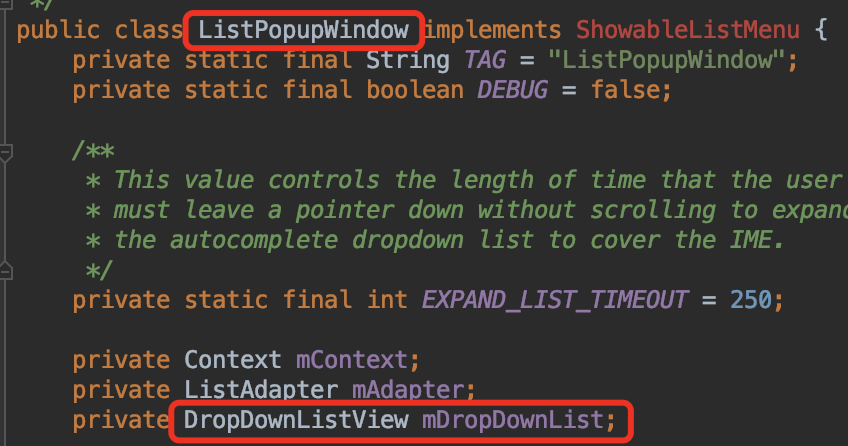
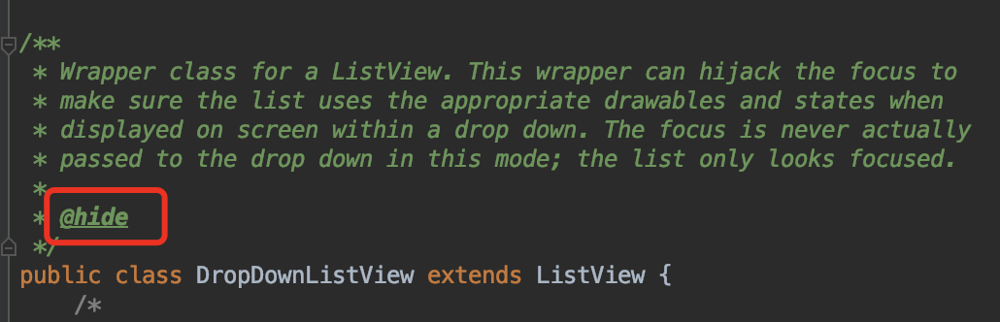
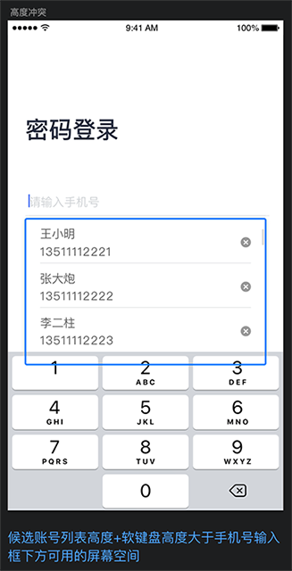

# AutoCompleteTextView最佳实践

写这篇文章主要是为了记录一次使用AutoCompleteTextView(以下简称ACTV)的踩坑过程，并复盘整个的解决流程。如果有心急的读者只想了解ACTV的基本使用方法可以直接参看——[《AutoCompleteTextView最佳实践-最简例子篇》](./simplest_sample/README.md)

### 一、AutoCompleteTextView简介
AutoCompleteTextView是一个可编辑的文本视图，可在用户键入时自动显示候选文本(以下简称ACTV)。候选文本列表显示在下拉菜单中，用户可以从中选择要替换编辑框内容的项目。

由以下的继承树，可以知道ACTV是继承自EditText的，它拥有EditText的所有功能。EditText我们已经再熟悉不过了。ACTV除了继承自EditText，它还是实现了Filter.FilterListener接口。FilterListener接口是用于监听ACTV内容改变时匹配对应的候选词列表。接下来就介绍一下它独特的功能属性。


### 二、AutoCompleteTextView的基本使用
**AutoCompleteTextView常用属性**

| 属性 | 描述 | 对应的Java方法 | 备注 |
| :-   | :-   | :-   | :-   |
|android:completionHint|设置出现在下拉菜单底部的提示信息|setCompletionHint(String hint)|hint不为空时生效|
|android:completionThreshold|设置触发补全提示信息的字符个数。最小值为1，设置的数值小于1时则置为1。|setThreshold(int threshold)|默认值为2(既不在布局文件中设置，也不调用Java方法设置threshold)。最小值为1，设置小于1的数字，会自动纠正为1。|
|android:dropDownHeight|设置下拉菜单的高度|setDropDownHeight(int height)|默认是WRAP_CONTENT。也可以设置为MATCH_CONTENT或具体的数值(java方法设置的数值的单位为像素)|
|android:dropDownWidth|设置下拉菜单的宽度|setDropDownWidth(int width)|同上。|
|android:dropDownVerticalOffset|设置下拉菜单于文本框之间的垂直偏移量|setDropDownVerticalOffset(int offset)|java方法设置的数值的单位为像素。|

**AutoCompleteTextView#setAdapter**

根据ACTV的源码可以知道，设置ACTV的Adapter需要继承ListAdapter且实现Filterable接口。因此可以使用ArrayAdapter。如果`ArrayAdapter`无法满足你的需求，则可以选择自定义Adapter。


因此ACTV设置了Adapter后就可以实现键入关键字显示候选词的效果了。

**[最简例子](./simplest_sample/README.md)效果展示**


### 三、需求简介

国际惯例先展示最终效果图：  


*笔者声明: 以下内容均已去除公司业务相关的敏感信息，纯属用于技术研究探讨。*

- 1 启动App打开登录页，默认加载最近一次登录的账号和密码
- 2 点击手机号输入框时，弹出候选列表
- 3 候选列表的高度为3条账号记录的高度
- 4 候选列表必须在输入框的下方(**提前剧透, 此处有大坑**)
- 5 输入手机号时，候选账号的手机号命中部分高亮显示
- 6 点击候选列表的右边x图标，item左滑显示删除按钮，点击删除，则删除此条账号记录
- 7 点击账号输入框右侧的x图标，清除账号输入框内容。党账号输入框无内容是不显示x图标；密码输入框同理
- 8 密码输入框右侧有切换密码可见性的按钮

*设计稿(已脱敏)*：



### 四、功能点实现

上述的功能点很多，这里我们着重讲解一下ACTV使用相关的功能实现(即第1~4条功能点)。其他功能将放在其他文章中详细讲解。

#### 1 启动App打开登录页，默认加载最近一次登录的账号和密码

从SharedPreference里取出来第一条账号，默认填充到手机号/密码的输入框里。(较简单，不赘述。)

#### 2 点击手机号输入框时，弹出候选列表

```Java
// 为手机号输入框设置点击事件:当点击手机号输入框时，展示候选账号列表窗口
mPhoneView.setOnClickListener(new View.OnClickListener() {
    @Override
    public void onClick(View v) {
        mPhoneView.showDropDown();
    }
});
```

#### 3 候选列表的高度为3条账号记录的高度

前面介绍过ACTV有一个`android:dropDownHeight`属性，对应的Java方法是`autoCompleteTextView#setDropDownHeight(int height)`。但问题在于**一条账号记录的高度**不是一个精确的数值。这也难不倒我，直接测量一条item的高度就成了。

那么问题来了，要获得itemHight首先要取得列表控件。如果你已经阅读过了[《AutoCompleteTextView最佳实践-最简例子篇》](./simplest_sample/README.md)的拓展阅读，你就会知道，ACTV的候选列表是一个窗口，具体的实现类是ListPopupWindow(以下简称LPW)。(没看的读者走一下[传送门](./simplest_sample/README.md#二、拓展阅读)再回来~)

因此列表控件也在LPW里。通过阅读LPW的源码可以知道，这个列表控件就是DropDownListView，是ListView的子类。


你如果不信上图的红字的话，我们来看一下ACTV里的setAdapter中是不是调用了LPW的setAdapter。



那么问题来了，找到了这个类有什么用，你需要取到对应的实例对象才行，而我们现在手里只有ACTV对象。那么久让我们从ACTV出发。通过查看ACTV源码，我们发现LPW对象是ACTV一个私有属性。



那么我们反射走一趟，拿到LPW对象。

```java
/**
 * 获取ACTV的ListPopupWindow对象
 *
 * @param textView AutoCompleteTextView
 * @return ListPopupWindow对象
 */
private static ListPopupWindow getListPopupWindow(AutoCompleteTextView textView) {
    try {
        Class<?> aClass = textView.getClass();
        Field field = null;
        while (aClass != null) {
            try {
                field = aClass.getDeclaredField("mPopup");
            } catch (NoSuchFieldException ignore) {
            } finally {
                aClass = aClass.getSuperclass();
            }
            if (field != null) break;
        }
        if (field == null) return null;
        field.setAccessible(true);
        return (ListPopupWindow) field.get(textView);
    } catch (Exception e) {
        return null;
    }
}
```

好了，现在我们有LPW对象了。如法炮制我们要拿到DropDownListView对象。通过查看ACTV源码，我们发现DropDownListView对象是LPW的一个私有属性。



那么我们再通过反射，拿到DropDownListView对象。不过DropDownListView在Android源码里是被标注了@hide的，我们无法直接拿到这个类，不过我们向上转型成它的父类ListView即可。



```java
/**
 * 获取DropDownListView对象
 *
 * @param lpw ListPopupWindow
 * @return DropDownListView对象
 */
private static ListView getDropDownListView(ListPopupWindow lpw) {
    try {
        Class<?> aClass = lpw.getClass();
        Field field = aClass.getDeclaredField("mDropDownList");
        field.setAccessible(true);
        return (ListView) field.get(lpw);
    } catch (NoSuchFieldException ignore) {
    } catch (IllegalAccessException ignore) {
    }
    return null;
}
```

现在ListView的对象实例也拿到了，那么要怎么获取ListView中一条item的高度呢？

```java
/**
 * 获取ListView的一条item的高度
 *
 * @param listView DropDownListView
 * @return 一条item的高度
 */
private static int getListViewItemHeight(ListView listView) {
    ListAdapter listAdapter = listView.getAdapter(); //得到ListView 添加的适配器
    if (listAdapter == null) return -1;
    View itemView = listAdapter.getView(0, null, listView); //获取其中的一项
    //进行这一项的测量，为什么加这一步，具体分析可以参考 https://www.jianshu.com/p/dbd6afb2c890
    itemView.measure(MeasureSpec.UNSPECIFIED, MeasureSpec.UNSPECIFIED);
    return itemView.getMeasuredHeight(); //item的高度
}
```

这里我们就可以拿到一条item的高度了。不过在测量的时候还有一个小小的策略：

- 当匹配到的账号数量小于3时，为ACTV的候选列表高度设置为WRAP_CONTENT。
- 当匹配到的账号数量大于等于3时，为ACTV设置为3条账号记录的高度。即itemHeight*3。

为什么这么做呢？因为强制设置成3条记录的高度的话，当只有1或2条记录时，底下会有一块空白出现，页面展示很不友好。

因此这里应当对上面的getListViewItemHeight方法稍作修改：

```java
/**
 * 获取ListView的一条item的高度
 *
 * @param listView DropDownListView
 * @param maxCount 候选记录最多可显示的条数(现在定的是3,不知道以后会不会改)
 * @return -2:WRAP_CONTENT; 其他值一条item的高度
 */
private static int getListViewItemHeight(ListView listView, int maxCount) {
    ListAdapter listAdapter = listView.getAdapter(); //得到ListView 添加的适配器
    if (listAdapter == null) return -1;
    if (listAdapter.getCount() < maxCount) {
        return ViewGroup.LayoutParams.WRAP_CONTENT;
    } else {
        View itemView = listAdapter.getView(0, null, listView); //获取其中的一项
        //进行这一项的测量，为什么加这一步，具体分析可以参考 https://www.jianshu.com/p/dbd6afb2c890这篇文章
        itemView.measure(View.MeasureSpec.UNSPECIFIED, View.MeasureSpec.UNSPECIFIED);
        return itemView.getMeasuredHeight(); //item的高度
    }
}
```

稍稍总结下上面的方法：

- 通过ACTV反射获取LPW实例；

- 通过LPW反射获取DropDownListView实例；

- 通过DropDownListView测量一条item的高度(如果item数量小于3，则返回WRAP_CONTENT)

那么综上所述，观察仔细的读者会发现这三个方法都是private的。是的，我们把这3个方法写在一个工具类里，然后我们还需要提供一个供外部调用的入口方法：

```java
/**
 * 设置AutoCompleteTextView的候选列表高度
 *
 * @param textView AutoCompleteTextView
 * @param maxCount 候选记录最多可显示的条数(现在定的是3,不知道以后会不会改)
 */
public static void setDropDownHeight(AutoCompleteTextView textView, int maxCount) {
    // 反射获取ListPopupWindow实例
    ListPopupWindow mPopup = getListPopupWindow(textView);
    if (mPopup == null) return;
    // 反射获取DropDownListView实例
    ListView mDropDownList = getDropDownListView(mPopup);
    if (mDropDownList == null) return;
    // 获取高度(候选列表项数小于maxCount时返回WRAP_CONTENT)
    int itemHeight = getListViewItemHeight(mDropDownList, maxCount);
    if (itemHeight == ViewGroup.LayoutParams.WRAP_CONTENT) {
        textView.setDropDownHeight(itemHeight);
    } else {
        textView.setDropDownHeight(itemHeight * maxCount);
    }
}
```

接着，我们把这个方法拿去给ACTV设置上，一运行。诶？怎么肥四呀？不管用啊？？？


查看源码分析问题:

ACTV的showDropDown方法：

```java
/**
 * <p>Displays the drop down on screen.</p>
 */
public void showDropDown() {
    // ...省略部分代码...
    mPopup.show();
    // ...省略部分代码...
}
```

我们再进入mPopup的show方法中:

```java
/**
 * Show the popup list. If the list is already showing, this method
 * will recalculate the popup's size and position.
 */
@Override
public void show() {
    int height = buildDropDown();// 1 在show的时候会动态计算高度
    // ...省略部分代码...
    if (mPopup.isShowing()) {
    // ...省略部分代码...
    } else {
        final int heightSpec;
        if (mDropDownHeight == ViewGroup.LayoutParams.MATCH_PARENT) {
            heightSpec = ViewGroup.LayoutParams.MATCH_PARENT;
        } else {
            if (mDropDownHeight == ViewGroup.LayoutParams.WRAP_CONTENT) {
                heightSpec = height;
            } else {
                heightSpec = mDropDownHeight;
            }
        }
        mPopup.setWidth(widthSpec);
        mPopup.setHeight(heightSpec); // 2 并设置为mPopup的高度
    }
}
```

由上述两段代码可知，ACTV的候选框的高度是show的是动态计算的，因为我们提前设置高度没有任何意义。那么我把要将设置高度的这件事放在show方法的计算高度之后。


#### 坑点一：ACTV无法确保候选列表出现在输入框的下方

当输入框底部距离屏幕底部的距离不足以放下**3条候选账号记录的高度+软键盘的高度**时(也可能是1条或2条候选账号记录)，候选账号列表窗口会显示到输入框的上方。这种情况在小屏手机上容易出现；也可以通过下调手机号输入框在屏幕上的位置来复现。




### 最后的最后

虽然这是一个很小的需求。但里面蕴含的知识点可不少哟。感兴趣的读者可以参看

- 《AutoCompleteTextView最佳实践-最简例子篇》
- 《AutoCompleteTextView最佳实践-布局优化篇》
- 